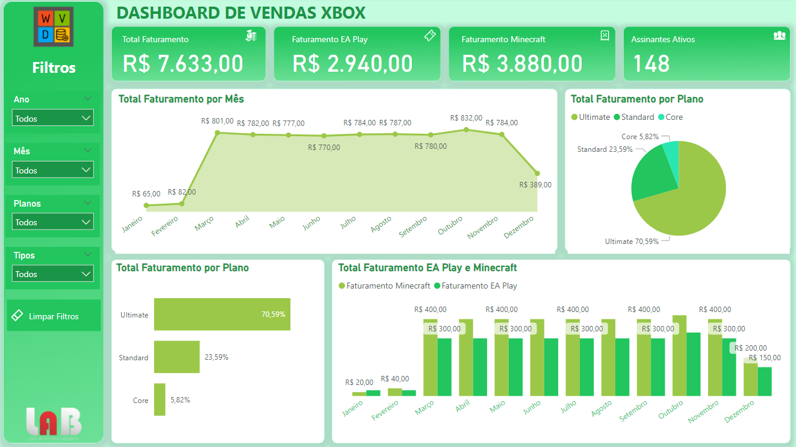

# Projeto Power BI: Faturamento de Assinaturas XBOX
> Curso Análise de Dados com Excel e Copilot

## Visão Geral
Este projeto tem como objetivo a criação de um dashboard em Power BI para análise do faturamento de assinaturas XBOX, incluindo planos principais, passes de temporada e valores relacionados a descontos. O projeto utiliza dados fictícios representados pela tabela `fVendas` e dimensões auxiliares como `Calendar`, `Periods`, `Time` e `Medidas`.

O dashboard fornece insights sobre receita, assinantes, produtos complementares e impacto de descontos, permitindo decisões baseadas em dados.

---

## Estrutura dos Dados

### **Tabela Principal: `fVendas`**
A tabela principal contém os dados transacionais das assinaturas, com as seguintes colunas:

| Coluna                     | Tipo      | Descrição                                           |
|----------------------------|-----------|---------------------------------------------------|
| `Subscriber ID`            | Int64     | Identificador único do assinante.                |
| `Name`                     | String    | Nome do assinante.                                |
| `Plan`                     | String    | Plano de assinatura.                              |
| `Start Date`               | DateTime  | Data de início da assinatura.                    |
| `Auto Renewal`             | String    | Indica se a assinatura possui renovação automática (Yes/No). |
| `Subscription Price`       | Int64     | Valor da assinatura.                              |
| `Subscription Type`        | String    | Tipo de assinatura.                               |
| `EA Play Season Pass`      | String    | Indica se o passe de temporada foi adquirido.     |
| `EA Play Season PassPrice` | String    | Valor do passe de temporada da EA Play.           |
| `Minecraft Season Pass`    | String    | Indica se o passe de temporada foi adquirido.     |
| `Minecraft Season Pass Price` | Int64  | Valor do passe de temporada do Minecraft.         |
| `Coupon Value`             | Int64     | Valor de desconto aplicado.                       |
| `Total Value`              | Int64     | Valor total após descontos.                       |

### **Dimensões Auxiliares**
- `Calendar`: Fornece suporte para análises temporais.
- `Periods`: Contém períodos específicos para segmentação de tempo.
- `Time`: Oferece granularidade temporal (dias, meses, anos).
- `Medidas`: Inclui medidas calculadas em DAX para o dashboard.

---

## Funcionalidades do Dashboard

1. **Análise de Receita:**
   - Receita total e líquida (com e sem descontos).
   - Receita por tipo de assinatura e produtos complementares.

2. **Análise de Assinantes:**
   - Contagem total de assinantes ativos e inativos.
   - Proporção de assinaturas com e sem renovação automática.

3. **Impacto dos Descontos:**
   - Comparação de receita antes e depois de aplicar cupons.

4. **Análise Temporal:**
   - Receita por períodos (mensal, trimestral, anual).
   - Taxa de crescimento de receita.

5. **Principais Assinantes:**
   - Lista dos assinantes com maior contribuição para a receita.

---

## Medidas DAX Utilizadas

- **Total Faturamento:** `SUM(fVendas[Total Value])`
- **Faturamento por Assinatura:** `SUMX(VALUES(fVendas[Subscription Type]), SUM(fVendas[Total Value]))`
- **Faturamento Médio por Assinatura:** `AVERAGE(fVendas[Subscription Price])`
- **Total de Assinantes:** `DISTINCTCOUNT(fVendas[Subscriber ID])`
- **Assinantes Ativos:** `CALCULATE(DISTINCTCOUNT(fVendas[Subscriber ID]), fVendas[Auto Renewal] = "Yes")`
- **Descontos Concedidos:** `SUM(fVendas[Coupon Value])`
- **Faturamento Líquido:** `[Total Faturamento] - [Descontos Concedidos]`

---

## Instruções para Reprodução

1. **Pré-requisitos:**
   - Instale o Power BI Desktop.
   - Tenha acesso ao arquivo de dados `base.xlsx` contendo a tabela `fVendas`.

2. **Configuração do Ambiente:**
   - Baixe este repositório.
   - Importe os dados para o Power BI utilizando a funcionalidade "Obter Dados".
   - Configure os relacionamentos entre as tabelas (`fVendas`, `Calendar`, etc.).

3. **Criação do Dashboard:**
   - Utilize as medidas DAX fornecidas para criar gráficos, tabelas e KPIs.
   - Inclua slicers para facilitar a filtragem de dados (por período, tipo de assinatura, etc.).

4. **Publicação:**
   - Após finalização, publique no Power BI Service.
   - Configure atualizações automáticas caso necessário.

---

## Dashboard

**Acesse online**: [Link](https://app.powerbi.com/view?r=eyJrIjoiNDU0ZmI2NTItMDNhNy00OTkzLTk2MTAtOWU4MDFkMTA4ZDhkIiwidCI6IjlmZjQ5YWNkLTJmNTMtNGJmMS04OTkwLTRjYzY0ZGM4YjljMiJ9)

---

## Contribuição
Sugestões e melhorias são bem-vindas! Abra uma issue ou envie um pull request para contribuir.

---

## Licença
Este projeto está licenciado sob a MIT License - veja o arquivo LICENSE para mais detalhes.
